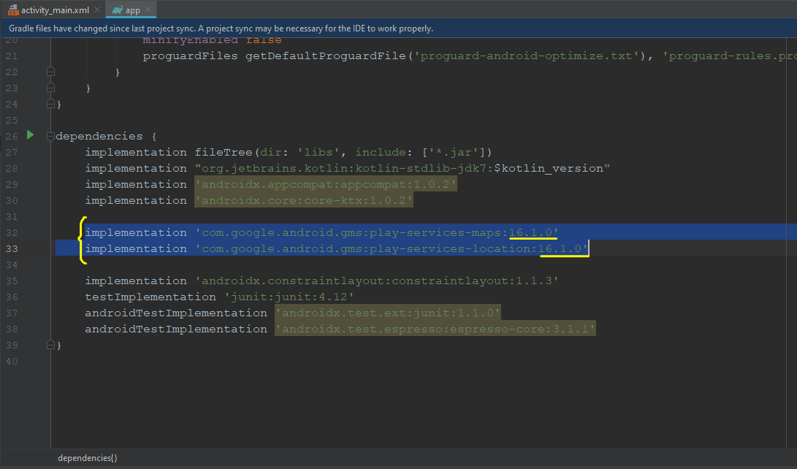

## TUTORIAL PARA LA GEOLOCALIZACIÓN

1-.En Android Studio creamos un proyecto nuevo vacio

2-.Dentro del Gradle Scripts, en la parte de build.gradle anexamos las siguientes dependencias en la parte correspondiente:

Debemos de verificar que la implementación play-services-maps y la play-services-location deben coincidir en la versión, es decir "16.1.0" 

3-.Ahora en la carpeta "manifest" vamos a agregar las siguientes dependencias:

   

De las cuatro dependencias las mas importantes son : "android.permission.ACCESS_COARSE_LOCATION" y "android.permission.ACCESS_FINE_LOCATION" donde éste segundo es para el GPS.

4-.Vamos ahora a crear una clave de los mapas, esto nos servirá para que se pueda visualizar el mapa y de nuestra ubicación en tiempo real. Nos vamos a la carpeta "app/new/Google/Google Maps Activity"

                                                                                       