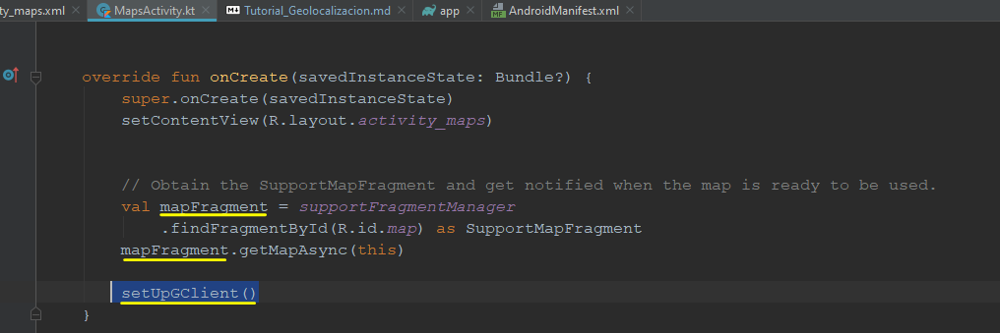
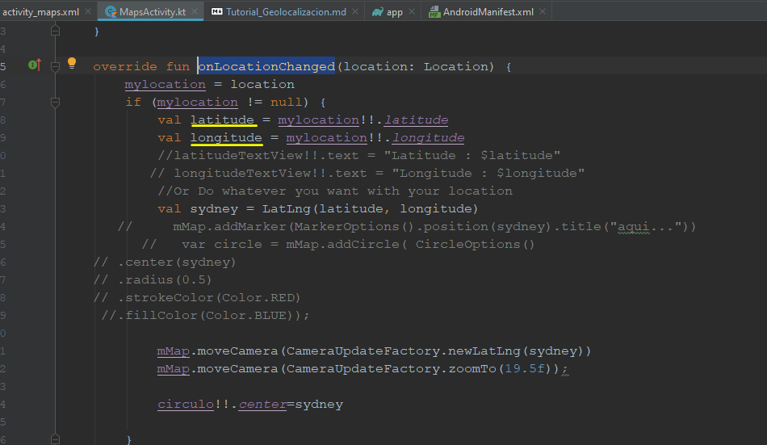

## TUTORIAL PARA LA GEOLOCALIZACIÓN

1-.En Android Studio creamos un proyecto nuevo vacio

2-.Dentro del Gradle Scripts, en la parte de build.gradle anexamos las siguientes dependencias en la parte correspondiente:

Debemos de verificar que la implementación play-services-maps y la play-services-location deben coincidir en la versión, es decir "16.0.0" 

3-.Ahora en la carpeta "manifest" vamos a agregar las siguientes dependencias:

   

De las cuatro dependencias las mas importantes son : "android.permission.ACCESS_COARSE_LOCATION" y "android.permission.ACCESS_FINE_LOCATION" donde éste segundo es para el GPS.

4-.Vamos ahora a crear una clave de los mapas, esto nos servirá para que se pueda visualizar el mapa y de nuestra ubicación en tiempo real. Nos vamos a la carpeta "app/new/Google/Google Maps Activity"

5-.Para que podamos hacer uso del Google maps, debemos autenticarnos con nuestra cuenta de gmail. Nos posicionamos en la carpeta "values", ingresamos al archivo google_maps_api.xml y copiamos la liga que nos aparece en esta clase para pegarla en un navegador.

6-.Una vez que pegamos esa liga en el navegador nos aparece la siguiente pantalla para registrar la aplicación para utilizar Maps SDK, aceptando las condiciones.

7-.Una vez que aceptemos las condiciones de uso, nos genera una Clave de API, la cual debemos copiar pues la pegaremos en la clase google_maps_api.xml

Es importante indicar que no debemos seleccionar la opción de "Restringir Clave" ya que ésto nos deshabilitará constantemente el uso de mapas.

8-.La clave que nos proporcionó la copiamos y la pegamos en "MapsActivity" en la parte que se indica subrayado en amarillo.

9-.Ingresamos a la clase "MapsActivity" el cual se generó cuando creamos "app/new/Google/Google Maps Activity". Esta clase es la más importante con la que se trabajará. Inicialmente se herada la clase AppCompatAActivity que de ahi se heredan todas las clases, además que implementamos 4 interfaces.

10-.La primer interfaz es "OnMapReadyCallback" la cual nos indica que una vez que se descargue el mapa podamos acceder al Googlemap que es el que se mostrará.

11-.La segunda interfaz es "GoogleApiClient.ConnectionCallbacks" indica que hay un cliente que hace la localización que se activa con el celular una vez que recibe la solicitud, lo que hace en el código es que cuando se tiene conexión da la geolocalización (latitud, longitud, etc)

12-.La tercer interfaz es "GoogleApiClient.OnConnectionFailedListener" la cual nos indicará en caso de que falle la conexión en caso de no tener red y no se pueda realizar la geolocalización.

13-.La cuarta interfaz "LocationListener" es la más importante pues es la que estará mostrando los cambios de la visualización de localización, es un "escuchador" en cuanto a indicar los cambios de ubicación.

14-.Cuando creamos un MapActivity en automático nos genera un "mMap: GoogleMap"

15-. Tenemos que declarar el Método "setUpGCliente()" , lo colocamos inmediatamente despues de ver el fragmento que inicializa el mapa.

16-.La función onMapReady nos la implementa por default al crear el MapActivity.

17-.Modificamos las coordenadas en la ubicación que nos da por default y colocamos las coordenadas en las que nos ubicamos.

18-.Configuramos el punto que se visulizará en el mapa el cual nos mostrará nuestra ubicación.

19-.Colocamos @Synchronized el cual hará que se repita cada determinado tiempo. Generamos un objeto "builder" de la clase GoogleApiClient , el cual el objeto builder inicializa la activity MapActivity para que nos podamos conectarnos a la api de Geolocalización, "this" hace referencia a ésta activity en la que estamos.

20-.A continuación habilitamos la autoadministración de la activity para que el gps del celular se active de manera automática sin necesidad de activarlo de forma manual,por lo que con el método "setUpGClient" se hará la activación de forma automática.

21-.Con el método "addConnectionCallbacks" el cual invoca las llamadas a la conexión para saber si esta disponible para la localización y el "addOnConnectionFailedListener" nos indicará si hay alguna falla en la conexión.

22-.El "addApi(LocationServices.API)" es la clase que nos va a dar la geolocalización y ubicación actual y con el googleApiClient procedemos a conectarnos.

23-.A continuación invocamos un método llamado "onLocationChanged" el cual nos va a ayudar a detectar cuando cambiamos de ubicación y recibe de argumentos un objeto de tipo location.

24-.Inicializamos mylocation, indicando que el argumento que se le va a pasar es el que se va a activar.

25-.Inicializamos la localización "mylocation" con la latitud y longitud.

26-.Cuando se cambie la localización le indicamos al mapa que con la cámara a nuestra variable "syndey" que es de nuestra ubicación.

27-.El método "onConnected" es de suma importancia ya que cuando se corra la aplicación éste metodo se activa y lo que hace es que automaticamente checa los permisos del GPS, ya que enciende el GPS como si se activara de forma manual.

28-.Con la clase ContexCompact indicamos que autocheque los permisos en el contexto del MapsActivity.

29-.En el segundo argumento le indicamos que nos vamos a meter en el archivo "android manifest" y vamos a encender el GPS.

30-.Hacemos la búsqueda de todos los permisos

31-.De todos los permisos que se encuentran, si el permiso de localización NO está habilitado entonces que enliste el permiso de localización y lo agregue al Manifiesto si es que el GPS esta APAGADO.

32-.Ahora si los permisos que se necesitan están vacios, que pida el permiso y que lo habilite.

33-.En cuanto cheque los persmisos que nos envíe la localización.

34-.El método "onRequestPermissionsResult" se activa despues de haberse activado el método checkPermissions. Una traducción rápida de éste método diría una vez que se dió el permiso dependiendo del resultado en el manifiesto se agrega y activamos lo que es la autorización y nuevamente activamos la localización en caso de que el usuario este cambiando de ubicación.

35-.Las siguientes partes de código son los permisos que están en hexadecimales y sirven para que cargue el número del permiso.

36-.El método "getMyLocation" es de suma importancia, colocamos el @@SuppressLintel cual nos ayudará a saber si ya se solicitó los permisos y en caso de no haberlos solicitado nos marcaría error. Cuando ejecutamos la aplicación nos envía un mensaje preguntando si queremos que acceda a nuestra ubicación , éste método es el que solicita ese permiso.

37-.Declaramos una variable que se llama "locationRequest" que es como una petición de la localización, con la clase "locationRequest" lo activamos.

38-.El objeto locationRequest invocamos su atributo intervalo el cual nos indicará cada cuanto tiempo se conectará al GPS y actualizará el Mapa, en éste caso será cada 3 segundo. Además le damos una PRIORIDAD la cual será ALTA para que nos de la ubicación lo más preciso.

39-.La siguiente parte del código es para activar los servicios de geolocalización.

40-.El método "onActivityResult" después de que acabe el activity nos da nuestra localización, El RESULT_OK -> getMyLocation() es en caso de aceptar que la aplicación muestre nuestra ubicación, el RESULT_CANCELED -> finish() se cerrará en caso de que de niegue el permiso a nuestra ubicación.

                                                                                      